# 프로젝트명: Mirroring

# [ 목차 ]
### 1. [컨셉](#불확실성)
### 2. [관련 이미지와 동영상](#2)
### 3. [대표 이미지 그리고 컨셉과 대표이미지 기반 작품 묘사](#3)
### 4. [Mirroring의 구성 요소](#4)
### 5. [게임 시스템 디자인](#5)
### 6. [요구사항(6주차)](#6)
### 6. [요구사항(1년차)](#66)
### 7. [키보드 이벤트에 대한 흐름도](#7)
### 8. [용어 정리](#8)
### 9. [개발 작업](#9)
### 10. [1주차 작업 결과](files/w09/index.md)
### 10. [2주차 작업 결과](files/w10/index.md)
### 10. [3주차 작업 결과](files/w11/index.md)
### 10. [4주차 작업 결과](files/w12/index.md)
### 10. [5주차 작업 결과](files/w13/index.md)
### 10. [6주차 작업 결과](files/w14/index.md)

# [컨셉] 

## 메인컨셉 : 불확실성

- 러브크래프트는 인간의 뇌가 불확실한 것에 대해 취약하다는 것을 알고 있었고 그는 "가장 오래되고 강력한 두려움은 미지의 것에 대한 두려움"이라고 말했습니다.
불확실성에 대한 공포가 인간이 경험하는 모든 공포의 근본적인 원인 이라는 것을 토대로 게임의 분위기를 형성하여 플레이어로 하여금 알 수 없는 불안감에서 오는 공포를 경험할 수 있는 게임을 제작하고자 합니다.

### 서브 컨셉 1 : 정보

- 완벽하지 않은 정보는 때로 난항을 격게 만드는 원인이 되기도 합니다. 게임 진행에 중요하게 작용하는 스토리 혹은 기믹의 정보를 부분적으로만 플레이어에게 제공하여 메인 컨셉을 보조하는 역할을 할 것입니다.

### 서브 컨셉 2 : 충격

- 게임 진행에 따라 알게 되는 게임의 스토리로 하여금 플레이어에게 새로운 충격을 주어 흥미를 유발할 수 있도록 할 것입니다.

### 서브 컨셉 3 : 의미

- 플레이어가 불확실성에서 벗어나기 위해 수행하는 행동에 의미를 부여하여 게임의 분위기를 자연스럽게 형성할 수 있도록 할 것입니다.

### 서브 컨셉 4 : 성찰

- 사회적 문제나 평소 도덕성과 이익의 갈등 등 다양한 문제들을 게임 속에 내포하여 플레이어로 하여금 스스로의 행동에 대해 성찰할 수 있는 기회를 제공할 것입니다.

### 서브 컨셉 5 : 희열

- 플레이어가 문제를 해결했을 때, 희열을 느끼고 다음 챕터로 넘어갈 수 있는 원동력을 제공할 것입니다.

  

# [관련 이미지 & 동영상] 

- 이미지  
  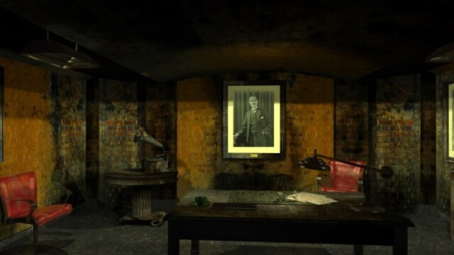
- 동영상
  [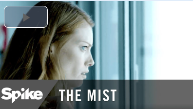](https://www.youtube.com/watch?v=YKe3znDCEMY)

  

# [대표 이미지] 

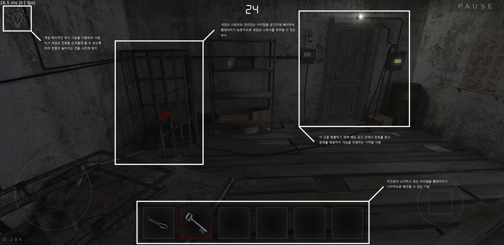

  

# [컨셉 & 대표이미지 기반 작품묘사]

> ### 대표이미지 기반 : 모든 일은 자신에게 되돌아 온다.

> ### 컨셉 기반: 게임의 조작법은 키보드의 W, A, S, D키를 통하여 캐릭터의 위치를 조작하고 마우스를 통하여 플레이어 캐릭터의 상하좌우 시아를 변경합니다.키보드의 F키를 눌러 화면 중앙 크로스헤어 위치에 있는 물체와 상호작용 할 수 있습니다.문제를 해결하고 정보를 얻어 다음 방으로 갈 수 있는 열쇠를 얻으며 게임을 진행합니다.

  

# [<미러링> 구성 요소] 

- 모든 일은 자신에게 되돌아 온다.
- (https://hclass.pcu.ac.kr:8888/2022b/project/w03/%EA%B2%8C%EC%9E%84%EA%B5%AC%EC%84%B1%EC%9A%94%EC%86%8CS/%EA%B9%80%ED%83%9C%EB%9E%91%EC%9C%A4%ED%99%8D%EC%9D%B8.pdf)

 

## 1. 메커니즘

[도전 과제]

1. 모든 방의 문제를 해결하고 탈출하는 것.
2. 방에 흩어져 있는 정보로 주인공이 여기에 오게 된 이유를 파악하는 것.

[재미 요소]

1. 물체와의 상호작용 : 상호작용을 통하여 플레이어가 능동적으로 문제의 힌트 혹은 게임 스토리의 정보를 습득할 수 있도록 하여 탐색의 흥미를 자아냄.
2. 힌트 : 문제의 해결 방식을 유추할 수 있는 힌트 혹은 문제 자체를 힌트의 형식으로 제공하여 플레이어가 방안에 숨겨진 문제들을 찾고 해결할 수 있도록 함.
3. 문제 : 방을 탈출하기 위한 수단으로 하나의 문제를 여러 과정들로 분리하여 게임의 난이도를 높이고 사용자에게 게임의 몰입감을 제공함.
4. BGM 및 효과음 : 현실적인 사운드를 이용하여 사용자에게 현실감을 주어 게임 속 공간에 있는 것 같은 몰입감을 제공함.

 

## 2. 이야기

[만들게 된 배경]  
개인주의적 성향이 유행하고 있는 현재 사회에서 개인주의와 이기주의를 혼동하여 살아가는 사람들이 많아지고 있고 개인주의와 이기주의의 측면으로 접근하지 않더라도 사회적 동물로써 상호관계 간 최소한의 배려 및 존중조차 하지 않는 잘못된 이념이 문제없이 적용되고 있는 단체들이 존재한다. 주변에서 흔하게 볼 수 있는 예시로써 왕따 문제가 있다. 우리는 게임을 통해 원활하고 완만한 인간관계가 서로 간의 존중과 배려에서 비롯하고 자신의 사소한 행동이 때로는 상대방에서 정신적, 신체적으로 크게 영향을 끼칠 수 있다는 경각심을 게임을 통해 상기시키고자 한다.

[카메라 관점]  
1. 1인칭 시점을 채택하여 플레이어에게 몰입감과 현실감을 제공함.
2. 화면 UI를 간소화하여 플레이어가 게임 속 상황에 몰입할 수 있는 환경을 제공함.
3. 좌측 상단에 플레이어가 획득한 아이템을 아이콘으로 보여주어 시각적으로 확인할 수 있도록 함.
4. 우측 상단에 플레이어의 도전과제를 볼 수 있는 버튼을 배치하여, 게임이 순조롭게 진행될 수 있도록 함.

 

## 3. 미적요소

[디자인]
캐릭터 : 주변에서 볼 수 있는 건장한 20대 남성의 모델을 사용.
오브젝트 : 현실에 실제로 존재할 것 같은 디자인의 물건(책장, 탁자, 액자, 시계) 모델을 사용.
상호작용 : 물체들의 중력작용과 캐릭터의 움직임 등이 현실성 있게 작용하여 실제처럼 구현.

[컬러]  
캐릭터 : 대한민국 20대 남성을 모티브로 하고 있으므로 살구색 피부의 검정머리 남성으로 구현.
오브젝트 및 주변환경 : 허름한 집, 정리가 안된 창고의 분위기를 자아내기 위해 어둡고 얼룩진 색상으로 표현.

[음향]  
캐릭터 : 걷거나 상호작용할 때, 무겁고 둔탁한 음향을 사용하여 으스스한 분위기 조성.
오브젝트 및 주변환경 : 바람이 새는 소리와 물건이 떨어지는 소리, 문이 천천히 열리는 소리 등 으스스한 분위기를 조성할 수 있는 음향을 활용.
 

## 4. 기술

1. 물체의 상호작용에 물리엔진을 적용하여 현실적인 물체의 움직임을 구현.
2. 음향의 싱크를 맞춰 캐릭터와 물체의 움직임에 현실성을 더함.

 

# [<미러링> 게임 시스템 디자인] 

## 1. 게임 오브젝트 분해  

|연번|오브젝트 이름|오브젝트 이미지|  
|:---:|:---:|:---:|  
|1|종이류||  
|2|침대|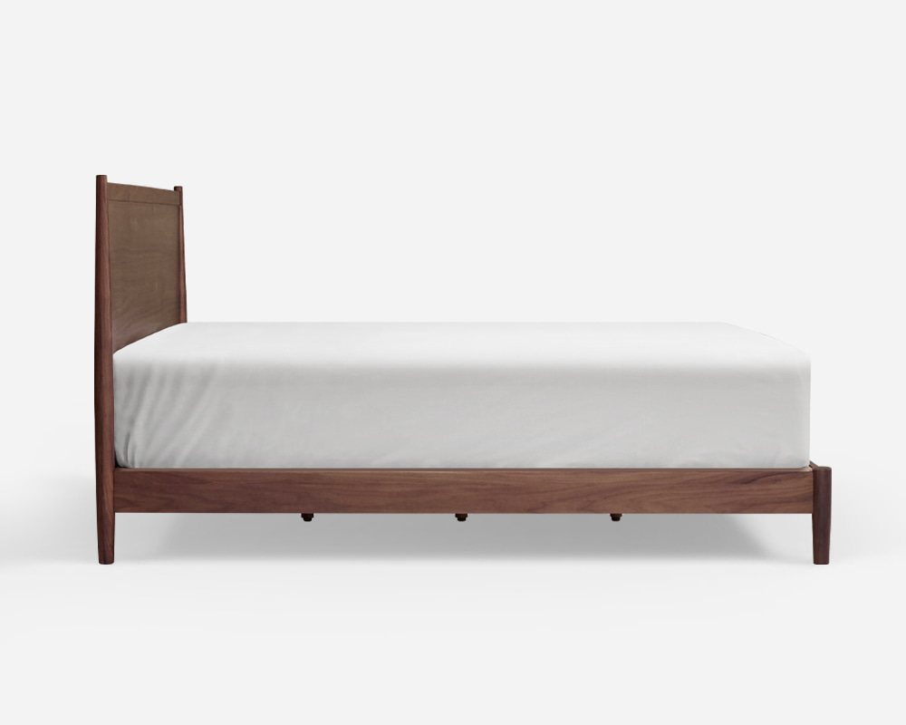|  
|3|거울||  
|4|서랍|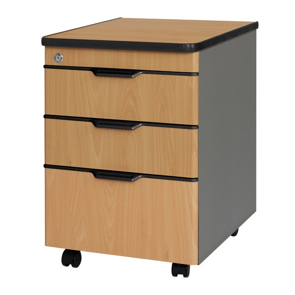|
|5|사진류||  
|6|책상류|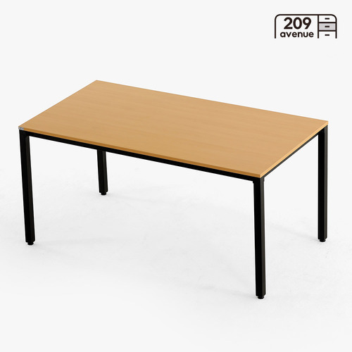| 
|7|금고류|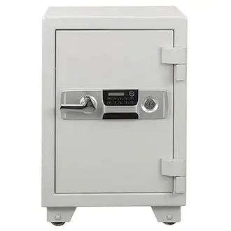|  
|8|책장류|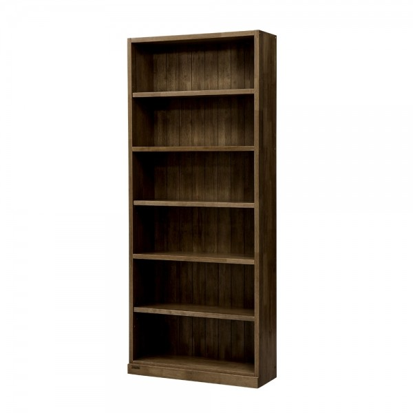|  
|9|작은상자|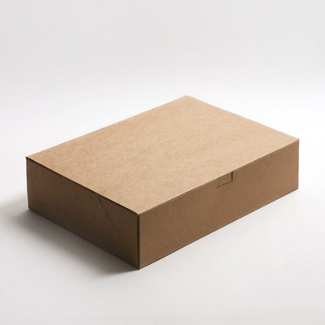|  
|10|일기류|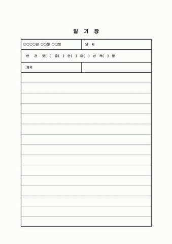|  
|11|졸업앨범|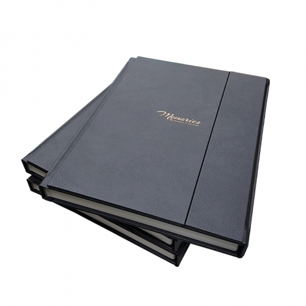|  
|12|액자|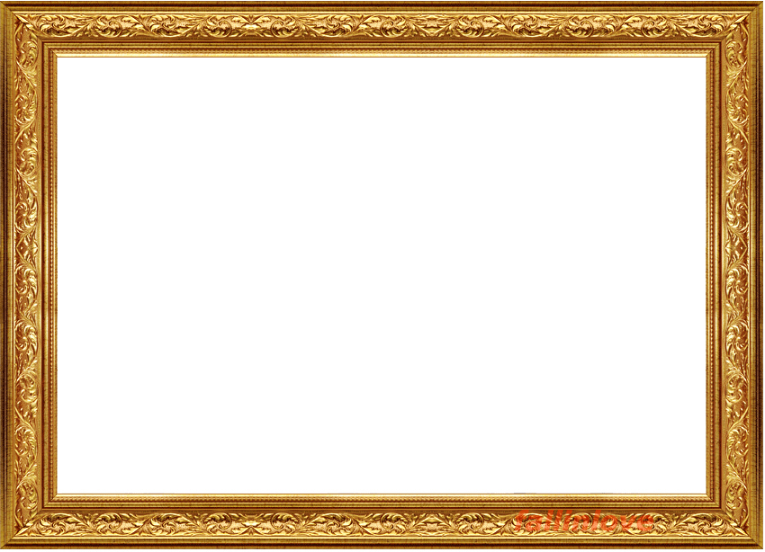|  
|13|열쇠류|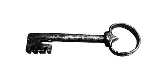|  
|14|문||  
|15|나침반||  
|16|소파||  
|17|신문|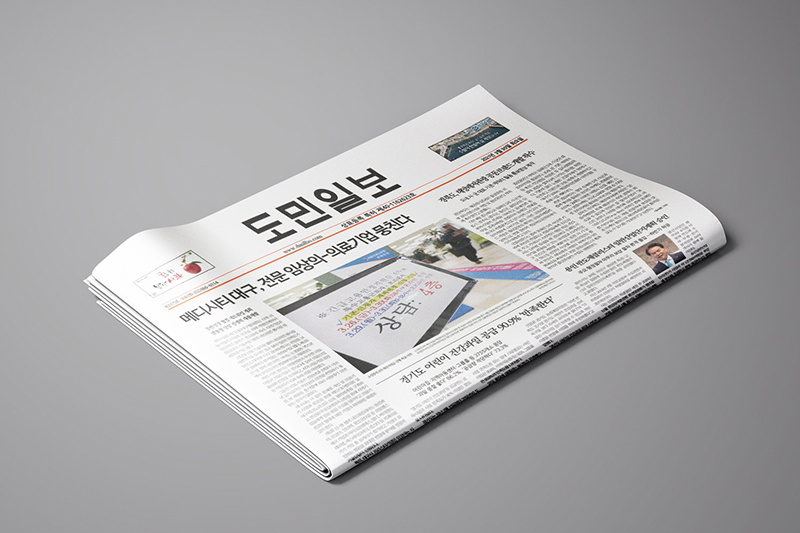|  
|18|질문지|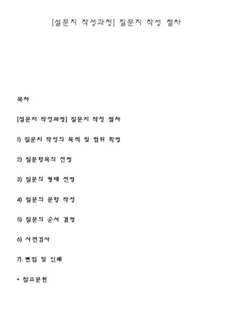|  

  

## 2.파라미터 뽑아보기
 

### 1) 오브젝트 이름 : 문
 

|속성|속성 값|설명|비고|  
|:---:|:---:|:---:|:---:|  
|상태1 (is_Open)|false|문이 열려있는지 알려주는 파라미터||  
|상태2 (is_Lock)|false|문이 잠겨있는지 알려주는 파라미터||
|고유 번호|1~30|문과 열쇠의 번호가 같아야 열 수 있다||
|사운드|Open사운드|문을 열 때 재생할 사운드||
|사운드|Close사운드|문을 닫을 때 재생할 사운드||

  

### 2) 오브젝트 이름 : 서랍
 

|속성|속성 값|설명|비고|  
|:---:|:---:|:---:|:---:|  
|상태1 (is_Open)|false|서랍이 열려있는지 알려주는 파라미터||  
|상태2 (is_Lock)|false|서랍이 잠겨있는지 알려주는 파라미터||
|사운드|Open사운드|서랍을 열 때 재생할 사운드||
|사운드|Close사운드|서랍을 닫을 때 재생할 사운드||

  

### 3) 오브젝트 이름 : 손전등
 

|속성|속성 값|설명|비고|  
|:---:|:---:|:---:|:---:|
|소지 배터리 최댓값|4|배터리 소지 최댓값||
|소지 배터리 갯수|2|현재 소지하고 있는 배터리 갯수||
|배터리 양 최댓값|10|갈아 끼운 배터리 양의 최댓값||    
|배터리 감소 속도|1.0|사용할 때 배터리가 감소하는 속도||      
|토글 키|KeyCode.R|손전등을 켜고 끌 수 있는 버튼||
|리로드 키|KeyCOde.F|손전등 배터리를 갈아 끼울 수 있는 버튼||
|사운드|On사운드|손전등을 켤 때 재생할 사운드||
|사운드|Off사운드|손전등을 끌 때 재생할 사운드||

  

### 4) 오브젝트 이름 : 열쇠
 

|속성|속성 값|설명|비고|  
|:---:|:---:|:---:|:---:|  
|고유 번호|1~30|문과 열쇠의 번호가 같아야 열 수 있다||
|사운드|열쇠 사운드|열쇠를 사용할 때 재생할 사운드||
 

## [<미러링> 개발 요구사항] 
- 메인메뉴에서 시작하기 버튼과 종료하기 버튼이 있음.
- 시작하기 버튼 누르면 게임 화면이 나타남.
- 종료하기 버튼 누르면 게임 종료함.
- 게임화면에는 왼쪽 아래에 현재 가지고 있는 아이템이 표시됨. (아이템을 먹어야만 나타남. 사용시 없어짐.)
- 플레이 시점은 1인칭이고, WASD를 이용해 움직이며 마우스로 시점을 움직일 수 있다.
- F키로 상호작용 가능한 아이템과 상호작용이 가능함. (사진등을 상호작용 시 사진을 확대해서 볼 수 있음.)
- 잠긴 문이나 서랍등은 각각에 맞는 열쇠가 있어야만 열 수 있다. (서랍1을 열려면 서랍1 열쇠가 필요.)
- 금고는 상호작용 시 숫자 다이얼이 나오며 맞는 숫자를 입력하면 열린다. 
- 모든 수수께끼를 풀고 탈출하게 되면 게임이 종료된다.
- 게임이 종료되면 메인메뉴로 돌아가게 된다.
