# 프로젝트명: Mirroring (개발자: 김태랑)

# [ 목차 ]
### 1. [컨셉](#불확실성)
### 2. [관련 이미지와 동영상](#2)
### 3. [대표 이미지 그리고 컨셉과 대표이미지 기반 작품 묘사](#3)
### 4. [Mirroring의 구성 요소](#4)
### 5. [게임 시스템 디자인](#5)
### 6. [게임의 규칙](#6)
### 7. [6주차 요구사항](#7)
### 8. [1년차 요구사항](#8)
### 9. [키보드 이벤트에 대한 흐름도](#9)
### 10. [게임 스토리보드](#10)
### 11. [개발작업 일정](#11)

  

# [컨셉] 

## 메인컨셉 : 불확실성

- 러브크래프트는 인간의 뇌가 불확실한 것에 대해 취약하다는 것을 알고 있었고 그는 "가장 오래되고 강력한 두려움은 미지의 것에 대한 두려움"이라고 말했습니다.
불확실성에 대한 공포가 인간이 경험하는 모든 공포의 근본적인 원인 이라는 것을 토대로 게임의 분위기를 형성하여 플레이어로 하여금 알 수 없는 불안감에서 오는 공포를 경험할 수 있는 게임을 제작하고자 합니다.

### 서브 컨셉 1 : 정보

- 완벽하지 않은 정보는 때로 난항을 격게 만드는 원인이 되기도 합니다. 게임 진행에 중요하게 작용하는 스토리 혹은 기믹의 정보를 부분적으로만 플레이어에게 제공하여 메인 컨셉을 보조하는 역할을 할 것입니다.

### 서브 컨셉 2 : 충격

- 게임 진행에 따라 알게 되는 게임의 스토리로 하여금 플레이어에게 새로운 충격을 주어 흥미를 유발할 수 있도록 할 것입니다.

### 서브 컨셉 3 : 의미

- 플레이어가 불확실성에서 벗어나기 위해 수행하는 행동에 의미를 부여하여 게임의 분위기를 자연스럽게 형성할 수 있도록 할 것입니다.

### 서브 컨셉 4 : 성찰

- 사회적 문제나 평소 도덕성과 이익의 갈등 등 다양한 문제들을 게임 속에 내포하여 플레이어로 하여금 스스로의 행동에 대해 성찰할 수 있는 기회를 제공할 것입니다.

### 서브 컨셉 5 : 희열

- 플레이어가 문제를 해결했을 때, 희열을 느끼고 다음 챕터로 넘어갈 수 있는 원동력을 제공할 것입니다.

  

# [관련 이미지 & 동영상] 

- 이미지  
  
- 동영상
  

  

# [대표 이미지] 

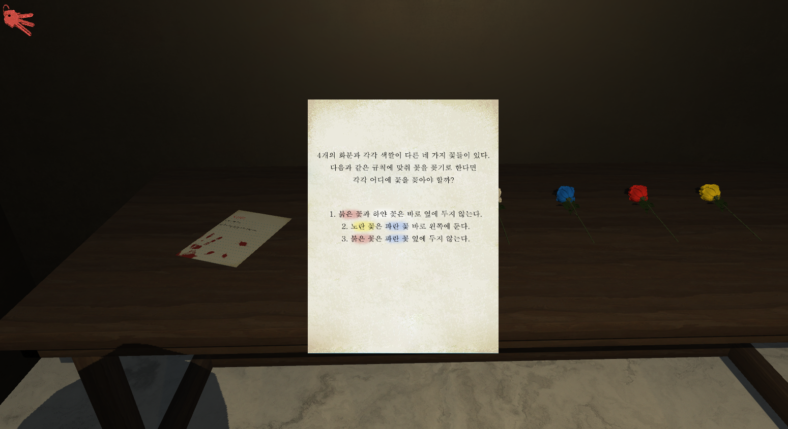

  

# [컨셉 & 대표이미지 기반 작품묘사]

> ### 시작 화면 :
> - 화면은 전체적으로 어둡게 구성하여 플레이어에게 심리적인 공포감을 주고 있습니다.
> - 좌측 하단에 게임의 조작법을 기재하여 누구든 조작법을 헷갈리지 않게 하였고 우측 하단에는 게임을 시작하는 버튼과 게임을 종료하는 버튼을 두어 간편한 UI를 구성하였습니다.
> - 현재 상황에서 ESC를 이용해 사용자 메뉴를 이용할 수 있습니다.
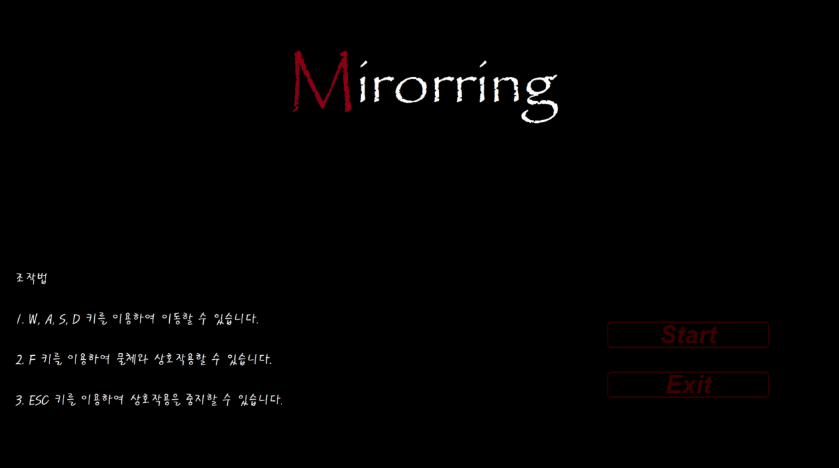

 

> ### 게임 화면 :
> - 전체적으로 UI를 최소화하여 사용자가 게임에 쉽게 몰입할 수 있는 환경을 조성하였습니다.
> - 좌측에 현재 플레이어가 소지한 아이템이 표시됩니다.
> - ESC키를 이용하여 설정창을 이용할 수 있습니다.
> - 설정창에서 Screen Option을 통해 해상도 조절이 가능합니다.
> - 설정창에서 Sound Option을 통해 BGM, 캐릭터 발소리, 오브젝트 효과음등을 조절할 수 있습니다.
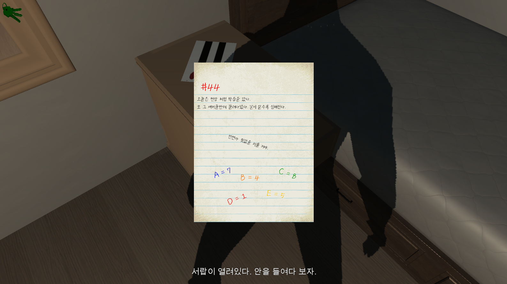
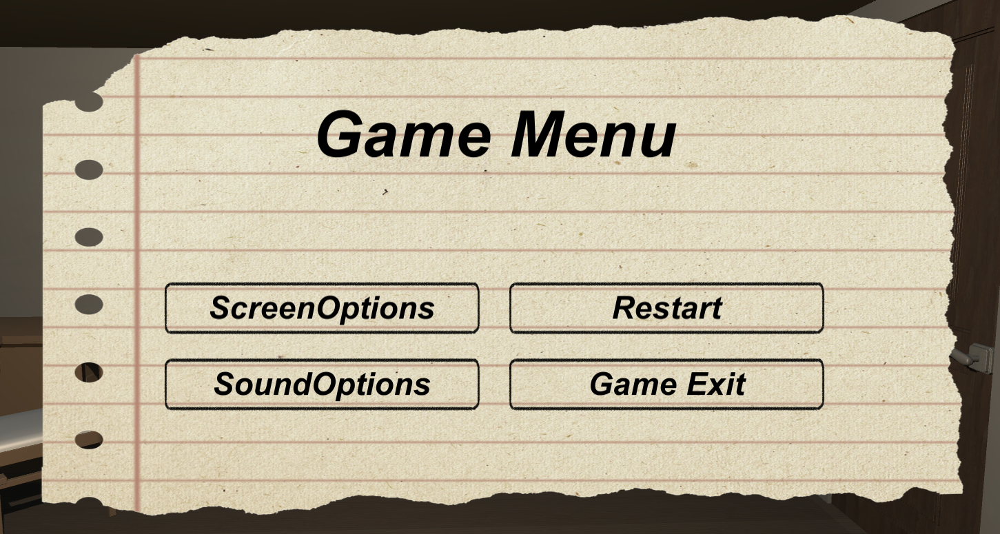

  

# [<미러링> 구성 요소] 

- 모든 일은 자신에게 되돌아 온다.
- (https://hclass.pcu.ac.kr:8888/2022b/project/w03/%EA%B2%8C%EC%9E%84%EA%B5%AC%EC%84%B1%EC%9A%94%EC%86%8CS/%EA%B9%80%ED%83%9C%EB%9E%91%EC%9C%A4%ED%99%8D%EC%9D%B8.pdf)

 

## 1. 메커니즘

[도전 과제]

1. 모든 방의 문제를 해결하고 탈출하는 것.
2. 방에 흩어져 있는 정보로 주인공이 여기에 오게 된 이유를 파악하는 것.

[재미 요소]

1. 물체와의 상호작용 : 상호작용을 통하여 플레이어가 능동적으로 문제의 힌트 혹은 게임 스토리의 정보를 습득할 수 있도록 하여 탐색의 흥미를 자아냄.
2. 힌트 : 문제의 해결 방식을 유추할 수 있는 힌트 혹은 문제 자체를 힌트의 형식으로 제공하여 플레이어가 방안에 숨겨진 문제들을 찾고 해결할 수 있도록 함.
3. 문제 : 방을 탈출하기 위한 수단으로 하나의 문제를 여러 과정들로 분리하여 게임의 난이도를 높이고 사용자에게 게임의 몰입감을 제공함.
4. BGM 및 효과음 : 현실적인 사운드를 이용하여 사용자에게 현실감을 주어 게임 속 공간에 있는 것 같은 몰입감을 제공함.

 

## 2. 이야기

[만들게 된 배경]  
개인주의적 성향이 유행하고 있는 현재 사회에서 개인주의와 이기주의를 혼동하여 살아가는 사람들이 많아지고 있고 개인주의와 이기주의의 측면으로 접근하지 않더라도 사회적 동물로써 상호관계 간 최소한의 배려 및 존중조차 하지 않는 잘못된 이념이 문제없이 적용되고 있는 단체들이 존재한다. 주변에서 흔하게 볼 수 있는 예시로써 왕따 문제가 있다. 우리는 게임을 통해 원활하고 완만한 인간관계가 서로 간의 존중과 배려에서 비롯하고 자신의 사소한 행동이 때로는 상대방에서 정신적, 신체적으로 크게 영향을 끼칠 수 있다는 경각심을 게임을 통해 상기시키고자 한다.

[카메라 관점]  
1. 1인칭 시점을 채택하여 플레이어에게 몰입감과 현실감을 제공함.
2. 화면 UI를 간소화하여 플레이어가 게임 속 상황에 몰입할 수 있는 환경을 제공함.
3. 좌측 상단에 플레이어가 획득한 아이템을 아이콘으로 보여주어 시각적으로 확인할 수 있도록 함.
4. 우측 상단에 플레이어의 도전과제를 볼 수 있는 버튼을 배치하여, 게임이 순조롭게 진행될 수 있도록 함.

 

## 3. 미적요소

[디자인]
1. 캐릭터 : 주변에서 볼 수 있는 건장한 20대 남성의 모델을 사용.
2. 오브젝트 : 현실에 실제로 존재할 것 같은 디자인의 물건(책장, 탁자, 액자, 시계) 모델을 사용.
3. 상호작용 : 물체들의 중력작용과 캐릭터의 움직임 등이 현실성 있게 작용하여 실제처럼 구현.

[컬러]  
1. 캐릭터 : 대한민국 20대 남성을 모티브로 하고 있으므로 살구색 피부의 검정머리 남성으로 구현.
2. 오브젝트 및 주변환경 : 허름한 집, 정리가 안된 창고의 분위기를 자아내기 위해 어둡고 얼룩진 색상으로 표현.

[음향]  
1. 캐릭터 : 걷거나 상호작용할 때, 무겁고 둔탁한 음향을 사용하여 으스스한 분위기 조성.
2. 오브젝트 및 주변환경 : 바람이 새는 소리와 물건이 떨어지는 소리, 문이 천천히 열리는 소리 등 으스스한 분위기를 조성할 수 있는 음향을 활용.
 

## 4. 기술

1. 물체의 상호작용에 물리엔진을 적용하여 현실적인 물체의 움직임을 구현.
2. 음향의 싱크를 맞춰 캐릭터와 물체의 움직임에 현실성을 더함.

 

# [<미러링> 게임 시스템 디자인] 

## 1. 주요 오브젝트 분해  

|연번|오브젝트 이름|오브젝트 이미지|  
|:---:|:---:|:---:|  
|1|주인공|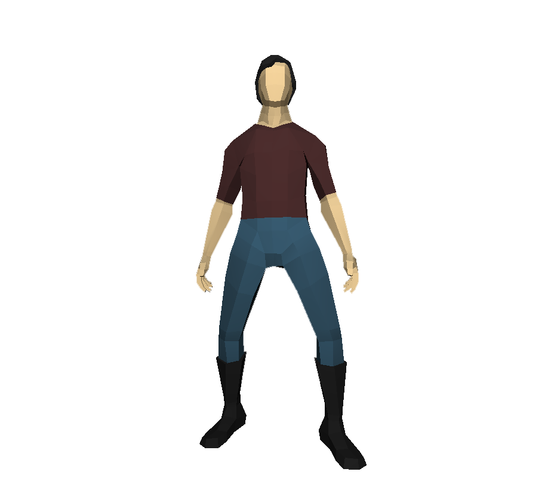| 
|2|흑막|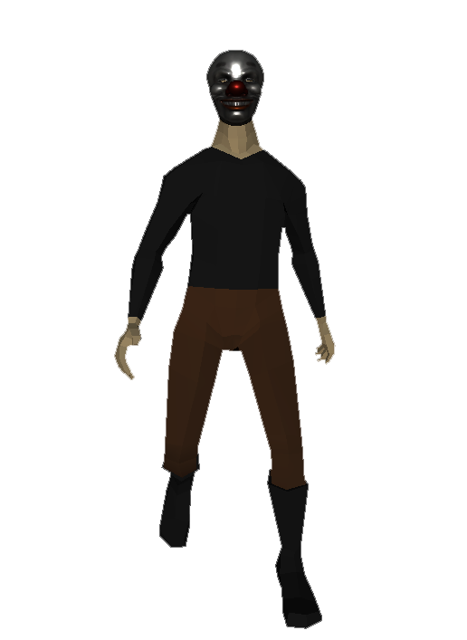| 
|3|일기|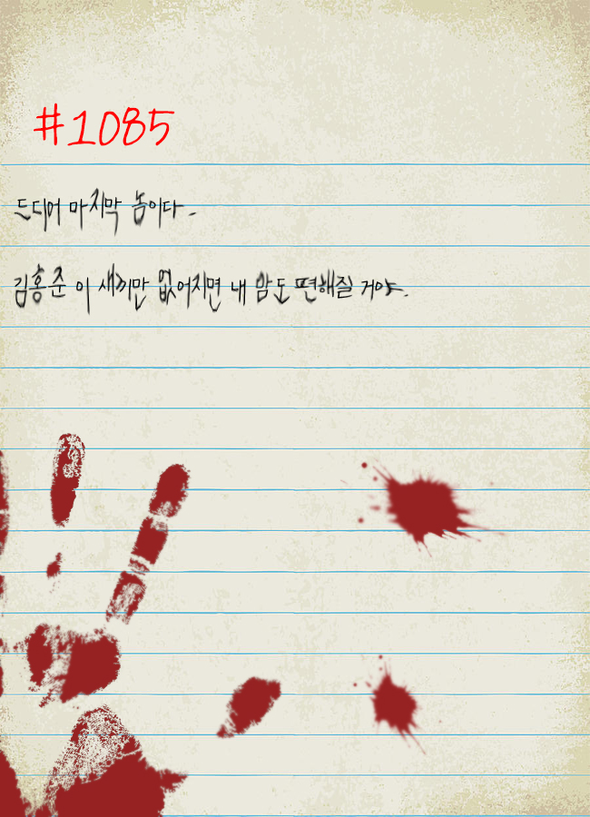| 
|4|거울|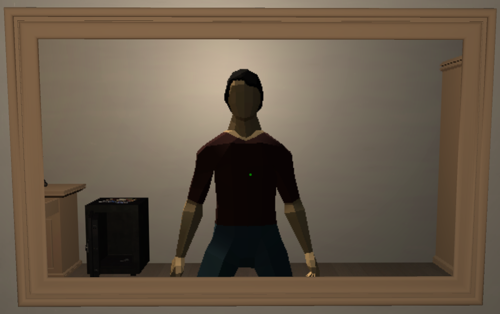|  
|5|사진|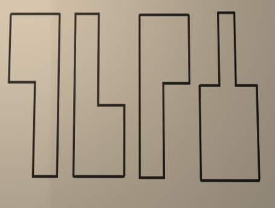|   
|6|꽃|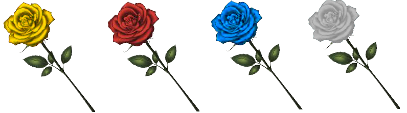|         
|7|열쇠|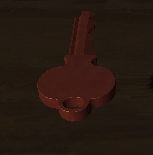|  
|8|문|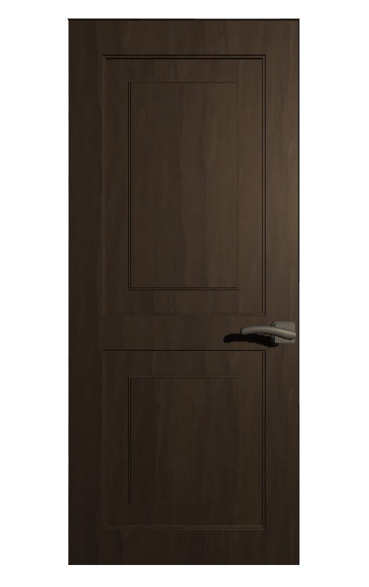|     
|9|신문||  
|10|문제|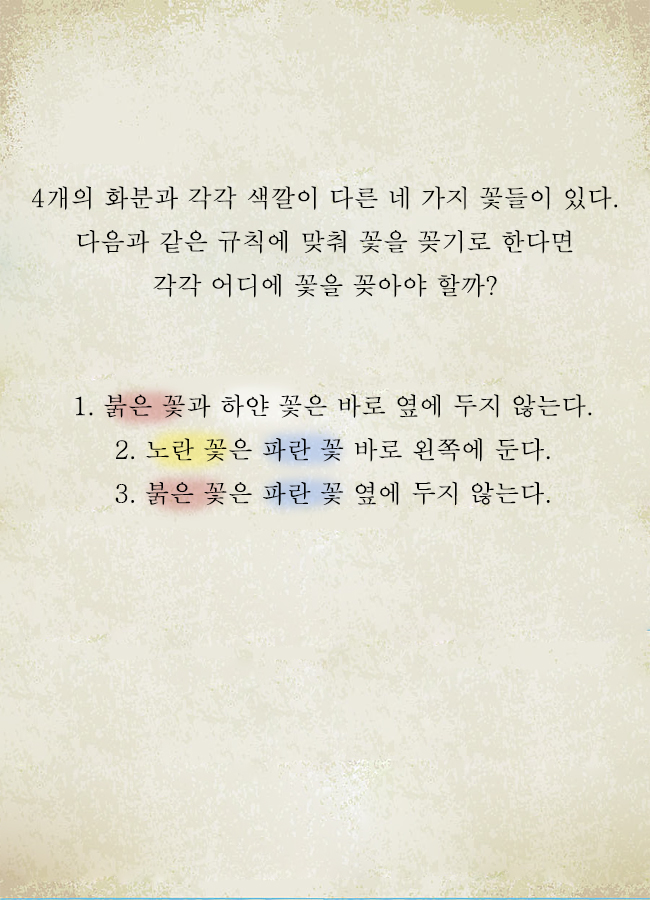|  

  

## 2.파라미터 뽑아보기
 

### 1) 오브젝트 이름 : 주인공 Player
 

|속성|영문명칭|설명|  
|:---:|:---:|:---:|  
|속도 |(PlayerSpeed)|플레이어의 상태(Walk)에 대한 속도값을 설정한다.|  
|소지품 |(items)|플레이어가 습득한 item을 저장한다.|
|스테이지 클리어| (Stage Clear) |플레이어의 게임 진행 단계를 저장한다.|

  

### 2) 오브젝트 이름 : 액자 Frame
 

|속성|영문명칭|설명|  
|:---:|:---:|:---:|  
|낙하 확인 |(dropCheck)|물체가 상호작용을 여부를 저장한다.|  

  

### 3) 오브젝트 이름 : 서랍 Drawer
 

|속성|영문명칭|설명|  
|:---:|:---:|:---:|  
|잠금 확인 |(openDrawer)|서랍이 현재 열릴 수 있는지 확인한다.|  

  

### 4) 오브젝트 이름 : 금고 Safe
 

|속성|영문명칭|설명|  
|:---:|:---:|:---:|  
|잠금 확인 |(openSafe)|금고가 현재 열릴 수 있는지 확인한다.|  

  

### 5) 오브젝트 이름 : 문 Door
 

|속성|영문명칭|설명|  
|:---:|:---:|:---:|  
|잠금 확인 |(openDoor)|문이 현재 열릴 수 있는지 확인한다.|  

  

## 3.행동 뽑아보기
 

### 1) 오브젝트 이름 : 주인공 Player
 

|행동|영문명칭|설명|  
|:---:|:---:|:---:|
|앞으로 이동|WalkF|플레이어 캐릭터를 앞으로 이동한다.|  
|뒤로 이동|WalkB|플레이어 캐릭터를 뒤로 이동한다.|  
|오른쪽으로 이동|WalkR|플레이어 캐릭터를 오른쪽으로 이동한다.|
|왼쪽으로 이동|WalkL|플레이어 캐릭터를 왼쪽으로 이동한다.|
|상호작용 하기|Interaction|F키를 눌러 Object와 상호작용한다.|
|시야 변경|Looking|마우스를 이용하여 시야를 변경한다.|

  

### 2) 오브젝트 이름 : 액자 Frame
 

|행동|영문명칭|설명|  
|:---:|:---:|:---:|
|상호작용 확인|InteractionCheck|Player가 상호작용 했는지 확인한다.|  

  

### 3) 오브젝트 이름 : 서랍 Drawer
 

|행동|영문명칭|설명|  
|:---:|:---:|:---:|
|열쇠 유무 확인|KeyCheckDrawer|Player가 열쇠를 가지고 있는지 확인한다.|  

  

### 4) 오브젝트 이름 : 금고 Safe
 

|행동|영문명칭|설명|  
|:---:|:---:|:---:|
|비밀번호 확인|PasswordCheck|Player가 입력한 비밀번호가 맞는지 확인한다.|

  

### 5) 오브젝트 이름 : 문 Door
 

|행동|영문명칭|설명|  
|:---:|:---:|:---:|
|열쇠 유무 확인|KeyCheckDoor|Player가 열쇠를 가지고 있는지 확인한다.|

  

### 6) 오브젝트 이름 : 열쇠 Key
 

|행동|영문명칭|설명|  
|:---:|:---:|:---:|
|획득 확인|GetKey|Player가 열쇠를 획득한 상태인지 확인한다.|

  

### 7) 오브젝트 이름 : 종이 및 사진 아이템 Paper or Picture Item
 

|행동|영문명칭|설명|  
|:---:|:---:|:---:|
|상호작용 확인|InteractionCheck|Player가 상호작용 했는지 확인한다.| 

  

## 4.상태 뽑아보기
 

### 1) 오브젝트 이름 : 주인공 Player
 

|현상태|전이상태|전이조건|  
|:---:|:---:|:---:|  
|기본상태(정지)||아무 키도 누르지 않음.|  
|모든상태중 (상호 작용중은 예외)|앞으로 이동|W키를 누름.|
|모든상태중 (상호 작용중은 예외)|뒤로 이동|S키를 누름.|
|모든상태중 (상호 작용중은 예외)|오른쪽으로 이동|D키를 누름.|  
|모든상태중 (상호 작용중은 예외)|왼쪽으로 이동|A키를 누름.|  
|모든상태중 (상호 작용중은 예외)|시야 변경|마우스를 움직임.|
|모든상태중 (상호 작용중은 예외)|물체와 상호작용 함.|물체에 Cursor를 두고 F키를 누름.|  

  

### 2) 오브젝트 이름 : 액자 Frame
 

|현상태|전이상태|전이조건|  
|:---:|:---:|:---:|  
|기본상태|||  
|기본상태|떨어짐 상태|플레이어가 상호작용을 할 경우 액자가 떨어짐. (한번 떨어지면 더 이상 상호작용 불가능.)|  

  

### 3) 오브젝트 이름 : 서랍 Drawer
 

|현상태|전이상태|전이조건|  
|:---:|:---:|:---:|  
|기본상태|||  
|기본상태|열림 상태|플레이어가 상호작용을 할 경우 서랍이 열림. (한번 열리면 더 이상 상호작용 불가능.)|  

  

### 4) 오브젝트 이름 : 금고 Safe
 

|현상태|전이상태|전이조건|  
|:---:|:---:|:---:|  
|기본상태|||  
|기본상태|열림 상태|플레이어가 상호작용을 할 경우 금고가 열림. (한번 열리면 더 이상 상호작용 불가능.)|  

  

### 5) 오브젝트 이름 : 문 Door
 

|현상태|전이상태|전이조건|  
|:---:|:---:|:---:|  
|기본상태|||  
|닫힘 상태|열림 상태|닫힘 상태에서 플레이어가 상호작용을 할 경우 문이 열림.|
|열림 상태|닫힘 상태|열림 상태에서 플레이어가 상호작용을 할 경우 문이 닫힘.| 

  

### 6) 오브젝트 이름 : 종이 및 사진 아이템 Paper or Picture Item
 

|현상태|전이상태|전이조건|  
|:---:|:---:|:---:|  
|기본상태|||  
|기본상태|열림 상태|플레이어가 물체와 상호작용 할 때, 플레이어의 화면 중앙에 해당 종이(사진)을 확대하여 표출해줌.|  

  

## 5.플레이어 캐릭터 속성
 

|속성|영문명칭|설명|
|:---:|:---:|:---:|  
|속도|PlayerSpeed|플레이어의 상태(Walk)에 대한 속도값을 설정한다.|  
|소지품|items|플레이어가 습득한 item을 저장한다.|
|스테이지 클리어|StageClear|플레이어의 게임 진행 단계를 저장한다.|

  

## 6.게임의 규칙 
 
 
### 1)핵심규칙  

1. 각 방을 하나의 스테이지로 간주한다.
2. 방 안의 사물들을 상호작용하여 힌트, 문제, 아이템을 획득 및 해결해 방문을 열어 다음 스테이지로 진행한다.
3. 어떤 물체가 상호작용 가능한지 게임은 알려주지 않고 플레이어가 직접 방(스테이지)을 돌아다니며 어떤 아이템이 상호작용 가능한지 확인해야 한다.

### 2)보조규칙  
1. 방 안에서 문제를 발견했다면 주변의 물체 및 아이템에서 얻은 힌트를 바탕으로 문제를 풀고 이를 통해 얻은 아이템과 정보를 이용해 방의 문을 열어야 함.
2. 상호작용이 가능한 물체에는 1회만 상호작용이 가능한 아이템과 여러번 상호작용이 가능한 아이템이 있으며, 어떤 아이템이 어디 있었는지 잘 기억하고 어떤 내용이였는지를 생각하면서 문제에 정보를 대입하여 풀어야 하는 게임입니다.

  

# 07 [개발 요구사항 & 흐름도] 
## [<미러링> 개발 요구사항]
## 6주차 요구사항  

### 1주차

- ~~시작화면에는 대표 이미지와 화면 중앙에 게임의 타이틀이 적혀 있고 화면 중앙 하단에는 "Press Any Key"의 문구가 적혀 있습니다.~~
- ~~시작화면에서 'Esc'키를 제외한 아무키를 누르면 게임화면으로 'FadeIn' 하며 게임이 시작됩니다.~~
- 게임화면에는 좌측 상단에 소지한 아이템이 표시되고 화면 중앙에 CrossHair가 작고 반투명하게 표시됩니다. (75% 완료)
- ~~플레이어는 게임화면에서 ''W, 'A', 'S', 'D'키를 이용하여 플레이어 캐릭터를 조종할 수 있습니다.~~
- ~~플레이어는 게임화면에서 마우스를 이용하여 플레이어 캐릭터의 시아를 조종할 수 있습니다.~~
- ~~플레이어는 게임화면에서 마우스를 통해 CrossHair를 상호작용하고 싶은 오브젝트에 가져가 'F'키를 누르는 것으로 게임 내의 오브젝트와 상호작용할 수 있습니다.~~
- ~~서랍, 책상서랍, 상자와 같은 오브젝트는 열쇠가 있어야 상호작용할 수 있고 열쇠가 있을 때, 상호작용을 하면 서랍 및 상자가 열립니다.~~
- ~~금고, 비밀번호가 있는 문과 같은 오브젝트는 상호작용을 하면 비밀번호를 입력할 수 있는 InputField가 화면 중앙에 표시되고 비밀번호가 일치할 경우 금고 및 문이 열립니다.~~
- ~~종이, 사진과 같은 오브젝트는 상호작용을 하면 플레이어의 화면 중앙에 해당 종이 및 사진이 확대되어 표시됩니다.~~
- ~~액자, 책장과 같은 오브젝트는 상호작용을 하면 액자가 떨어지거나 책장에 있는 졸업앨범이 나오는 등, 형태나 상태가 변합니다.~~

### 2주차

- ~~첫번째 스테이지는 가정 집의 안방을 모티브로 합니다.~~
- ~~첫번째 스테이지에서 필요로하는 오브젝트를 수집 및 제작합니다.~~
- ~~첫번째 스테이지에서 플레이어와 상호작용하는 오브젝트에 기능을 구현합니다.~~
- ~~작업명 : 첫번째 스테이지 구현~~

 

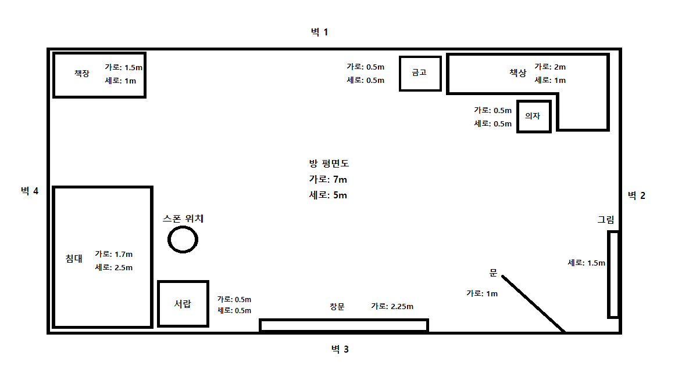

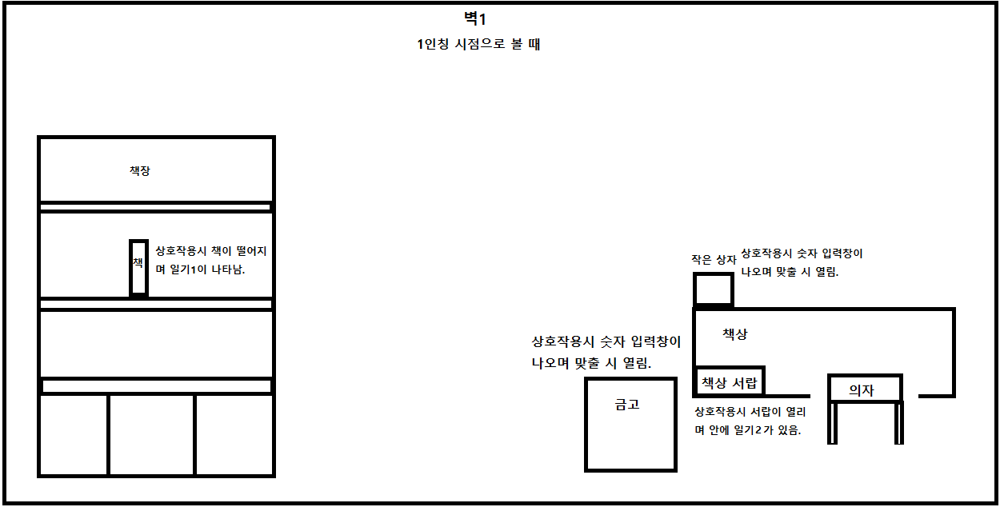

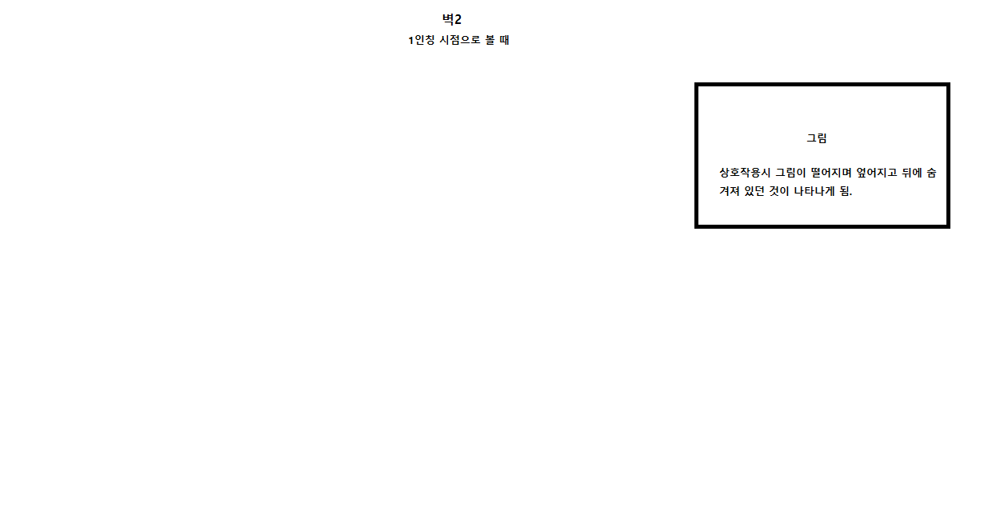

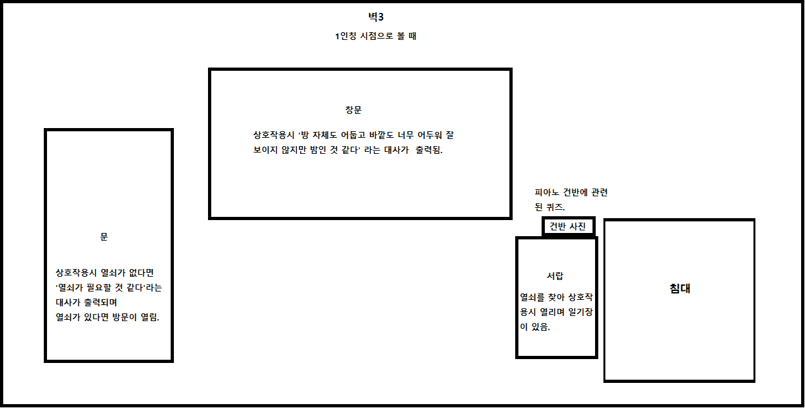

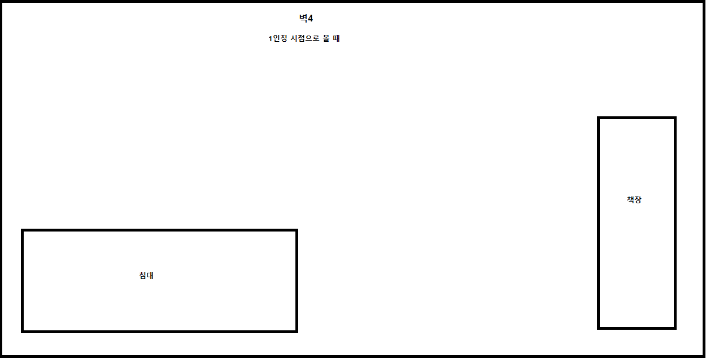
 

1888018_윤홍인 2주차 작업결과
- 동영상 파일 100MB를 초과하여 링크로 올립니다.
-https://drive.google.com/file/d/1S5JV3ExNrl89KURRYQYprSdjC8n0e3lR/view?usp=sharing

### 3주차

- 두번째 스테이지는 취조실을 모티브로 구현 합니다.
- 두번째 스테이지에서 필요로하는 오브젝트를 수집 및 제작합니다.
- 두번째 스테이지에서 플레이어와 상호작용하는 오브젝트에 기능을 구현합니다.

### 4주차

- 세번째 스테이지는 콘크리트가 드러난 복도를 모티브로 구현 합니다.
- 세번째 스테이지에서 필요로하는 오브젝트를 수집 및 제작합니다.
- 세번째 스테이지에서 플레이어와 상호작용하는 오브젝트에 기능을 구현합니다.

### 5주차

- 게임 내의 오브젝트는 플레이어와 상호작용시, 효과음을 추가 합니다.
- 스테이지의 문을 열쇠를 통해 혹은 비밀번호를 맞추어 열게되면 다음 스테이지를 진행 할 수 있게 됩니다.
- 스테이지를 클리어 하여도 플레이어는 이전 스테이지로 언제든 돌아올 수 있습니다.

### 6주차

- 마지막 스테이지의 문을 열고 문을 통과하면 게임이 클리어되고 시작화면으로 돌아옵니다.
- ProtoType 제작을 마무리 하고 오류 및 수정사항을 재검토합니다.
  

## 1년차 요구사항 

- 시작화면, 메뉴화면, 게임화면으로 총 3개의 화면으로 구성되어 있습니다.
- ~~시작화면에는 대표 이미지와 화면 중앙에 게임의 타이틀이 적혀 있고 화면 중앙 하단에는 "Press Any Key"의 문구가 적혀 있습니다.~~
- 시작화면에서 'Esc'키를 누르면 메뉴화면이 활성화 됩니다.
- 메뉴화면에는 게임새로시작 버튼과 게임저장 버튼, 게임종료으로 총 3개의 버튼으로 구성되어 있습니다.
- 메뉴화면에는 게임 내에서 나오는 소리의 음량을 조절할 수 있는 슬라이더가 있습니다.
- 메뉴화면에서 게임새로시작 버튼을 누를 경우, 현재까지 저장하였던 게임의 내용이 지워지고 처음부터 다시할 수 있게 됩니다.
- 메뉴화면에서 게임저장 버튼을 누를 경우, 현재까지 진행하였던 게임이 저장되어 게임을 재실행하였을 때, 저장한 스테이지부터 다시시작할 수 있습니다.
- 메뉴화면에서 게임종료 버튼을 누를 경우, 게임이 종료됩니다.
- 메뉴화면에서 음량 조절 슬라이더를 움직일 경우, 게임 내에서 나오는 소리의 음량을 조절할 수 있습니다.
- 메뉴화면이 활성화 되어있는 상태에서 'Esc'키를 누를 경우, 메뉴화면이 비활성화 되고 원래의 화면으로 돌아갑니다.
- ~~시작화면에서 'Esc'키를 제외한 아무키를 누르면 게임화면으로 'FadeIn' 하며 게임이 시작됩니다.~~
- 게임화면에는 좌측 상단에 소지한 아이템이 표시되고 화면 중앙에 CrossHair가 작고 반투명하게 표시됩니다. (75% )
- ~~플레이어는 게임화면에서 ''W, 'A', 'S', 'D'키를 이용하여 플레이어 캐릭터를 조종할 수 있습니다.~~
- ~~플레이어는 게임화면에서 마우스를 이용하여 플레이어 캐릭터의 시아를 조종할 수 있습니다.~~
- ~~플레이어는 게임화면에서 마우스를 통해 CrossHair를 상호작용하고 싶은 오브젝트에 가져가 'F'키를 누르는 것으로 게임 내의 오브젝트와 상호작용할 수 있습니다.~~
- ~~서랍, 책상서랍, 상자와 같은 오브젝트는 열쇠가 있어야 상호작용할 수 있고 열쇠가 있을 때, 상호작용을 하면 서랍 및 상자가 열립니다.~~
- ~~금고, 비밀번호가 있는 문과 같은 오브젝트는 상호작용을 하면 비밀번호를 입력할 수 있는 InputField가 화면 중앙에 표시되고 비밀번호가 일치할 경우 금고 및 문이 열립니다.~~
- ~~종이, 사진과 같은 오브젝트는 상호작용을 하면 플레이어의 화면 중앙에 해당 종이 및 사진이 확대되어 표시됩니다.~~
- ~~액자, 책장과 같은 오브젝트는 상호작용을 하면 액자가 떨어지거나 책장에 있는 졸업앨범이 나오는 등, 형태나 상태가 변합니다.~~
- 게임 내의 오브젝트는 플레이어와 상호작용시, 효과음을 추가 합니다.
- 플레이어가 상호작용 할 수 있는 오브젝트를 직관적으로 확인할 수 있도록 오브젝트에 테두리 효과를 추가합니다.
- 첫번째 스테이지는 가정 집의 안방을 모티브로 구현합니다.
- 첫번째 스테이지에서 필요로하는 오브젝트를 수집 및 제작합니다.
- 첫번째 스테이지에서 플레이어와 상호작용하는 오브젝트에 기능을 구현합니다.
- 두번째 스테이지는 취조실을 모티브로 구현 합니다.
- 두번째 스테이지에서 필요로하는 오브젝트를 수집 및 제작합니다.
- 두번째 스테이지에서 플레이어와 상호작용하는 오브젝트에 기능을 구현합니다.
- 세번째 스테이지는 콘크리트가 드러난 복도를 모티브로 구현 합니다.
- 세번째 스테이지에서 필요로하는 오브젝트를 수집 및 제작합니다.
- 세번째 스테이지에서 플레이어와 상호작용하는 오브젝트에 기능을 구현합니다.
- 선행 스테이지의 문제 및 힌트를 이용하여 풀어야 하는 문제를 추가 합니다.
- 선행 스테이지의 문제와 다른 방식의 문제를 추가합니다.
- 스테이지의 문을 열쇠를 통해 혹은 비밀번호를 맞추어 열게되면 다음 스테이지를 진행 할 수 있게 됩니다.
- 스테이지를 클리어 하여도 플레이어는 이전 스테이지로 언제든 돌아올 수 있습니다.
- 마지막 스테이지의 문을 열고 문을 통과하면 게임이 클리어되고 시작화면으로 돌아옵니다.
- ProtoType 제작을 마무리하고 오류 및 수정사항을 재검토합니다.
- 최종본 제작을 마무리하고 오류 및 수정사항을 재검토합니다.

  

## 03 키보드 이벤트 흐름도 
# [키보드 이벤트에 대한 흐름도] 

  

## 08 게임 스토리보드 

  

## 09 개발작업 일정 

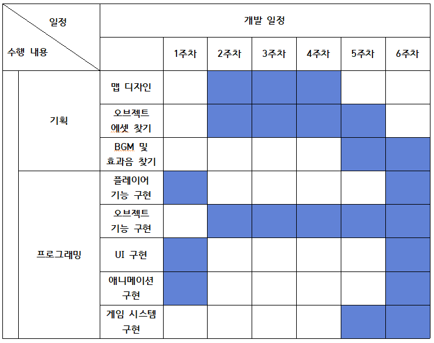

